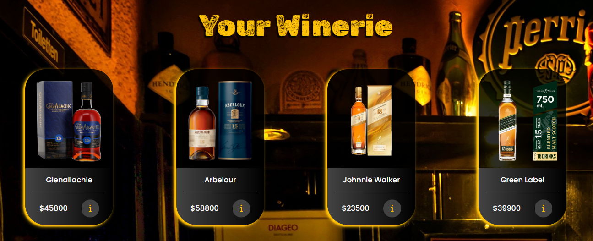

# Proyecto Final ReactJs CoderHouse 2022

Pagina Web con fines ilustrativos.


# WhiskysPage:

## Link Web

[whiskyspage.com](https://whiskyspage.netlify.app/)


# Descripcion:

Comercio electronico de venta de Whiskys.

# Instalacion:

## Una vez dentro de la carpeta coder-app ejectutar: 

```
npm start

```

# Explicativo de compra 

## Seleccion de productos:

Click en el icono "i" para ingresar en la informacion/detalle del producto.



---

## Seleccion de cantidad de productos

Selecciona la cantidad de productos deseados y agregalos al "Vaso" de compras.


---

## Compra de el/los producto/s

Selecciona "Buy" para proceder con la comprar y rellena los campos "name" "email" y "phone" para generar una Orden de comprar


---

## FELICIDADES! Orden de compra generada

Se genera de manera automatica un **Numero De Orden** unico que almacena todos los datos de tu compra (cantidad y tipo de producto, nombre, email y telefono para continuar con la compra)


---

## Video Explicativo de la ruta de compra

GIF con una pequeña demostracion de la ruta de compra


